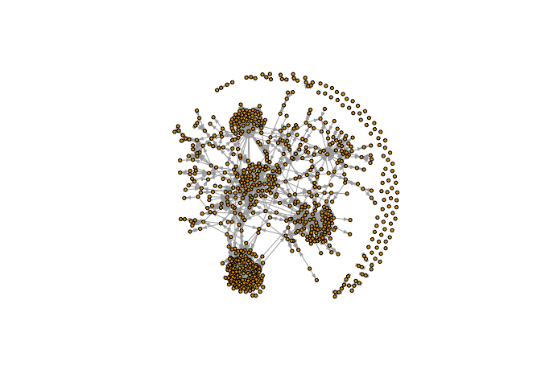
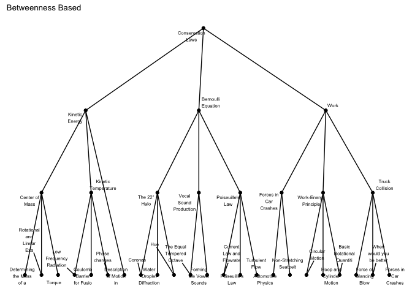
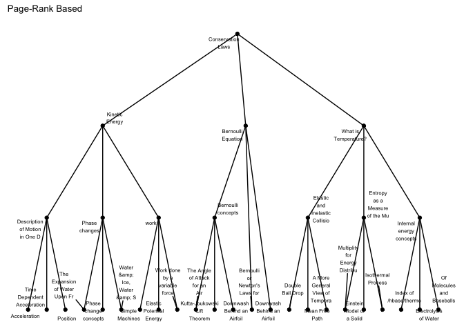
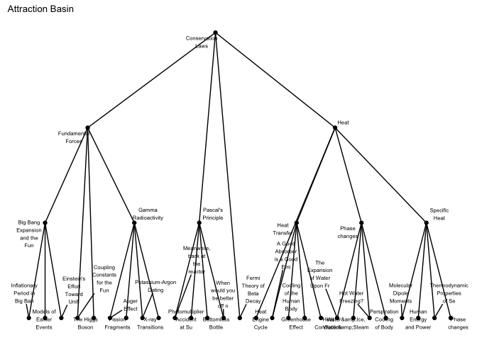
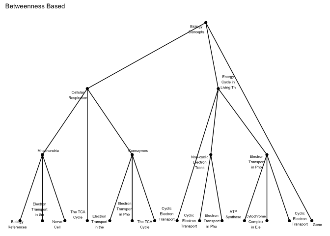
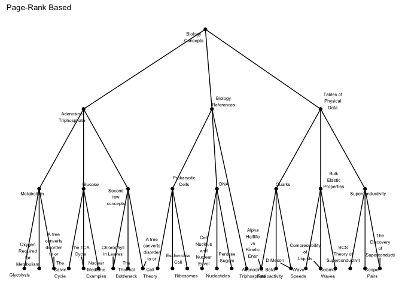
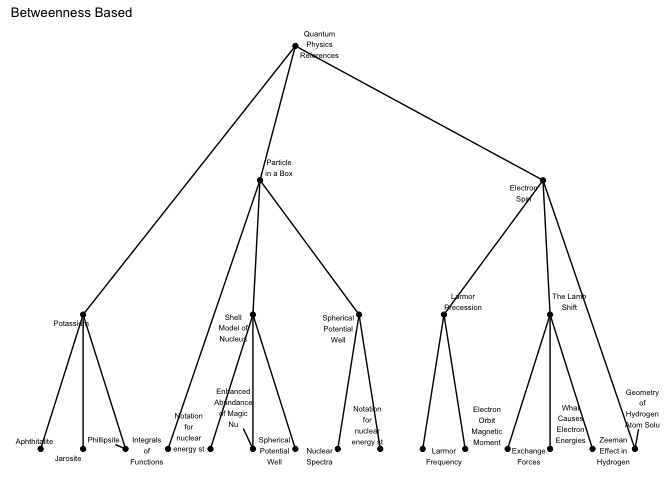
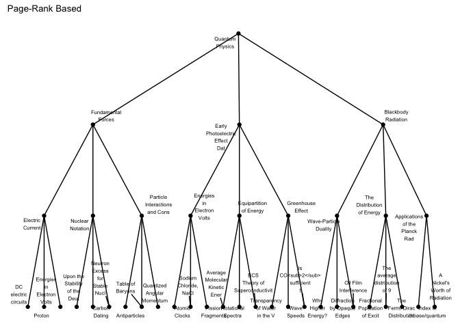
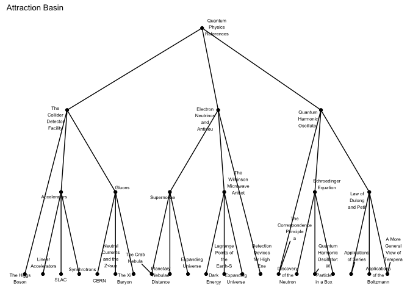

The Tree of Knowledge
================
Kaushik Mohan

Directory Structure
-------------------

-   `Code/Data` contains edgelists and node details of the scraped network used in this project
-   `Paper` includes the Muchnik, et.al. paper used as the primary reference for this project
-   `Presentations` contain the project proposal and final presentation for the course

Introduction
============

Objective
---------

-   To extract hierarchical structure of articles for a field (say, Mathematics, Physics..)

Why?
----

-   Individual learning is still hierarchical
-   Can be used to create structured curriculum content with just resources available on the web
-   Identify gaps in information on the web

Overview
--------

This project is an attempt to use (and improve) methods described in the paper by Muchnik, et.al. for extracting hierarchies from a network. The paper has been made available for reference in the respective folder within the repo. The end goal is to be able to use these techniques to create a knowledge tree from the Wikipedia EN article network which could be used to create a more structured online-reference/learning platform akin to a traditional Encyclopedia.

For the purpose of this project though, we use a smaller and more specific network of articles from HyperPhysics, a HTML Textbook (<http://hyperphysics.phy-astr.gsu.edu/hbase/hframe.html>). This textbook also has a more complete hyperlink structure compared to Wikipedia which should give us better results. Based on this network, we should be able to arrive at a tree structure which denotes the evolution of Physics literature and traditional structure in Physics instruction. The HyperPhysics page provides hierarchies based on content and some semantics which could be used as a reference to validate the results of the analysis.

As a work in progress at the end, we look at developing a better algorithm for extracting hierarchies using the idea of community detection to create each level of the hierarchy iteratively. The intution/hypothesis behind formulating such an approach is two-fold. Firstly, the previous methodologies identify hierarchies locally across all nodes to generate the full structure. Secondly, the cutoffs based on which hierarchical relationships are determined arbitrarily and tuned through validation. The proposed methodology addresses these issues by using eigenvector based community detection to create the hierarchy in a top-down approach. By first identifying a community of nodes (topics, in this context) and their hierarchical relationships, we then dive deeper into each topic to determine the hierarchies within. By iteratively going through this process, we hope to have a better and more intuitive hierarchical structure developing from the underlying network. This approach might perhaps more appilicable in this setting as the hypothesis is tied to the context.

Goals
-----

To summarize, the goals of this project are

1.  Use the methodologies defined in the paper to extract the hierarchical structure of HyperPhysics content

2.  Develop a commuity based iterative methodology for hierarchy extraction in a knowledge network

3.  Compare the results from the different methodologies and validate the results by surveying members in the Physics community

------------------------------------------------------------------------

Part 1: Scraping for Data
-------------------------

The first part of the project involves scraping through the HyperPhysics domain to create a network with pages as nodes and hyperlink between pages as edges. The webpage used here is HyperPhysics, a Physics and Math HTML textbook developed by Carl R. nave of Georgia State University. We use this because it's comprehensive coverage of most of physics and the linking structure between content pages. It also has a map of the content in some form which could provide validation to the extraction of trees from the link structure.

The url is <http://hyperphysics.phy-astr.gsu.edu/hbase/hframe.html>. We use the package 'rvest' which is similar to 'beautifulsoup' in Python used for web-scraping.

``` r
## We start with the first article in the Index, acceleration as the index page itself is a hframe and we are unable to parse it for links. 

url <- "http://hyperphysics.phy-astr.gsu.edu/hbase/acca.html"
webpage <- read_html(url)
nodes <- html_nodes(webpage,'a')
titles <- html_text(nodes)
links <- tolower(html_attr(nodes,"href"))
headings <- html_nodes(webpage,'h1')
h_regex <- regexpr(">(.*)<",as.character(headings[1]))
heading <- substr(as.character(headings[1]),(h_regex[1]+1),h_regex[1]+attr(h_regex,"match.length")-2)
heading
```

    ## [1] "Acceleration"

``` r
links
```

    ##  [1] NA                          "vel2.html#c1"             
    ##  [3] "vect.html#veccon"          "vect.html#vec1"           
    ##  [5] "units.html#uni4"           "deriv.html#c1"            
    ##  [7] "mot.html#mot1"             "hframe.html"              
    ##  [9] "hph.html"                  "hph.html#mechcon"         
    ## [11] "javascript:history.go(-1)"

``` r
titles
```

    ##  [1] ""                                              
    ##  [2] "velocity"                                      
    ##  [3] "vector"                                        
    ##  [4] "vector addition"                               
    ##  [5] "units"                                         
    ##  [6] "derivative"                                    
    ##  [7] "Motion equations when acceleration is constant"
    ##  [8] "Index"                                         
    ##  [9] " HyperPhysics"                                 
    ## [10] "     Mechanics "                               
    ## [11] "Go Back"

We can see all the links and page titles extracted from the HTML page. Next, we need to traverse through these URLs to find links in those iteratively. We keep track of the URLs visted and also include some URLs that we do not wish to look into as they do not have topic related content. In the below chunk, we write the function to extract all the links from a page while simultaneously cleaning the data for further use. We exclude javascript links, multimedia links and also stop the parsing from entering into an infinite loop when it reaches an index directory (<http://hyperphysics.phy-astr.gsu.edu/hbase/Kinetic/>) where sorting by Name, Size etc. create a slightly different URL. We also exclude URLs under the class/ subdomain as these don't contain Physics content but are structured courses that have been created within the hyperphysics domain. We account for many such cases and define a function to scrape for hyperlinks and simultaneously clean it for consumption.

    ## $main_page
    ## [1] "acca.html"
    ## 
    ## $main_page_title
    ## [1] "Acceleration"
    ## 
    ## $page_links
    ## [1] "vel2.html"  "vect.html"  "units.html" "deriv.html" "mot.html"  
    ## 
    ## $page_titles
    ## [1] "velocity"                                      
    ## [2] "vector"                                        
    ## [3] "units"                                         
    ## [4] "derivative"                                    
    ## [5] "Motion equations when acceleration is constant"

We note that the results now are lot cleaner compared to the raw output from before. Now that we have written a function to extract urls and titles, we will create a data structure for storing this information for all the pages we visit. We also define functions to add new pages and edges to the respective data frames.

Using these helper functions, we go over all the URLs and store the network structure.

    ##    user  system elapsed 
    ##  89.318  20.996 684.776

### Error handling

One of the major challenges in scraping the web for the network data was with handling the different formats of URLs and account for broken ones. At the end of the scraping, we find that there are 295 broken URLs. The next step is to try and fix these before scraping through them again. Through some manual inspection, we try and find patterns within these in order to fix them in batches rather than individually. We are able to identify that most of the cases involve a missing or incorrect parent domain. By taking care of these cases, we reduce the number down to less than 20 cases.

    ## [1] 295

    ##  [1] "magnetic/elecur.html"     "mechanics/volcon.html"   
    ##  [3] "acoustic/dbcon.html"      "molecule/schrcn.html"    
    ##  [5] "quantum/lascon.html"      "solar/radtel.html"       
    ##  [7] "astro/galaxy.html"        "geophys/stibarsen.html"  
    ##  [9] "minerals/geophys.html"    "astro/solarcon.html"     
    ## [11] "pertab/salt.html"         "solids/rectifiers.html"  
    ## [13] "quantum/qualig.html"      "pertab/diamond.html"     
    ## [15] "pertab/geophys.html"      "molecule/scattercon.html"
    ## [17] "molecule/atmoscon.html"   "music/string.html"       
    ## [19] "organic/chemcon.html"     "audio/trawvcon.html"

We ignore the 20 remaining cases, as it was difficult to manually identify the correct URLs for these. Next, we visit the unvisited fixed URLs and add the information to the dataset.

    ##    user  system elapsed 
    ##   0.790   0.167   4.775

Finally, we check the dataset once more to remove self-edges and any duplicates.

``` r
## Removing self edges from edge_list and 1st row with an NA
edge_list <- edge_list[-1,]
edge_list <- edge_list[-which(edge_list$from_url == edge_list$to_url),]

## Checking for and removing duplicate entries in page_details and edge_list
edge_list <- edge_list[!duplicated(edge_list), ]
page_details <- page_details[!duplicated(page_details),] ## URL and Title both match
page_details <- page_details[!duplicated(page_details$url),] ## Only URL duplicated
```

We store these final Edge List and Page Details data frames as CSVs as a backup, for easier access in the following sections and to work with a clean environment.

``` r
setwd("Code/Data")
write.csv(page_details,file="page_details.csv",row.names = FALSE)
write.csv(edge_list,file="edge_list.csv",row.names = FALSE)
```

We are finally left with 21,057 edges and 2931 nodes. We use this network data for further analysis in the following sections.

------------------------------------------------------------------------

Part 2: Network Stats
---------------------

In this section, we use this data from the scraping exercise to create a network object and perform some basic network analysis. We look at presenting a high-level overview of the network through some of it's node level and network level statistics in order gain an understanding of the underlying structure.

Importing the saved datasets with edge list and nodal attributes.

Creating the network objects and setting the vertex attributes. When the network is created, it numbers the nodes alphabetically based on the vertex name (in this case URL). We get these and store them for future reference.

#### Sample of the network

``` r
head(page_details,5)
```

    ##          url                   title
    ## 1  acca.html            Acceleration
    ## 2  vel2.html                Velocity
    ## 3  vect.html Basic Vector Operations
    ## 4 units.html          Physical Units
    ## 5 deriv.html          The Derivative

``` r
head(edge_list,5)
```

    ##    from_url     to_url
    ## 1 acca.html  vel2.html
    ## 2 acca.html  vect.html
    ## 3 acca.html units.html
    ## 4 acca.html deriv.html
    ## 5 acca.html   mot.html

##### Plot



From the plot of an induced sub-graph of 750 nodes, we can already see some clusters closely interconnected within in the network.

### Nodes, Edges and Density

    ## [1] "No. of Nodes:  2931"

    ## [1] "No. of Edges:  21058"

    ## [1] "Density:  0.00245"

### Degree Distribution

The first network statistics we look into furhter is the degree distribution. We want to verify if the distribution follows a power law as with several similar networks extracted from the web.

    ## [1] "Mean In-Degree:  7.1846"

    ## [1] "Mean Out-Degree:  7.1846"

It is a bit strange and interesting that the Avg. In and Out Degrees match perfectly. We then plot the degree distribution in the log-log scale to see if it is linear denoting a scale-free distribution.


We note that the degree distributions is almost perfectly linear in the log-log scale signifying preferential attachment in terms of the network structure. The out-degree distribution though starts off with a lower frequency of nodes with fewer degress. This perhaps indicates the nature of the textbook where most of the pages are linked with atleast a few other pages and very few pages have no links outward.

    ## log(as.numeric(row.names(table(in_degree)))) 
    ##                                     -1.36514

    ## log(as.numeric(row.names(table(out_degree)[-1]))) 
    ##                                         -1.551737

The estimated co-efficient or the power in the power-law form for the degree distributions are -1.365 and -1.552 for the In and Out degrees respectively. That is the in and out degrees roughly follow the following distributions.


### Geodesic Distance Distribution

Next, we look at the distrbution of the Geodesic distance between nodes. This measure gives us a sense of how close the nodes are from each other and along side a scale-free degree distribution, a short average geodesic distance (or network diameter) would indicate a small-world nature of the network as defined by Watts and Strogatz (1998).

    ## [1] "Average Geodesic Distance:  5.862"


We do observe that the Network Diameter small at ~5.86 and this is re-inforced by the above plot of the geodesic distance distribution.

### Centralization

The key network and nodal measure for our analysis is the Centrality and Centralization measures.The overall network centralization is 0.236. This gives us a sense of the centralization of the network relative to a star configuration which is maximally centrlized. A value of 0.236 implies that the network isn't highly centralized but at the same time the structure isn't purely random either with some nodes playing a central role.

    ## [1] "Network Centralization:  0.236"

------------------------------------------------------------------------

Part 3: Extracting hierarchies
------------------------------

In this section, we create the functions to extract hierarchies from the network and use these on the HyperPhysics article network. Four different hierarchy extraction methods are explored, namely

1.  Betweenness Centrality based
2.  Page-Rank based
3.  Attraction Basin
4.  Eigenvector based

The specific formulae and methodology are presented in following sub-sections where we explore each of these methodologies in detail. The first three methods listed above are as defined in the Muchnik, et.al. paper. The last methodology is an independent exploration of a different way to extract hierarchy which takes into account the clusters of topics in the network and extract the hierarchy iteratively starting from the highest-level allthe way down to the leaf nodes.

### Overview

To understand the core idea behind extracting hierarchies from a network, we look at a regular tree to start with. From the below sample tree marked by it's corresponding betweenness centralities, we can make the following observations:

-   Greater centrality corresponds to a higher level in the hierarchy
-   Nodes at the same level of hierarchy have similar centrality
-   Large difference in centrality for nodes unconnected with by an edge in the hierarchy


### 

These three fundamental ideas form the basis of hierarchy extraction in each of the following methods. The overall process of hierarchy extraction can be summarized as the following set of steps

1.  Define a suitable hierarchy score for each node: A hierarchy score for a node is a measure such as it's betweenness centrality which can be used to compare two nodes to determine the hierarchical relation between them. For a regular node such as the above example, we can simply use the betweenness centrality as the graph is regular. But in the case of real-world networks such as the one we are dealing with, every node need not have the same degree and hence we look at nodal measures which are scaled by their respective degrees.

2.  Compare scores for 2 neighboring nodes (in the underlying undirected network): We then compare the scores of two nodes in the underlying network and determine if one is higher in the hierarchy if the ratio of the scores is between a lower and an upper threshold and it has a higher score. This does not depend on the direction of the edge between the two nodes in the underlying network.

3.  Define the right cutoffs: The choice of cutoffs affects the hierarchical network output. A high upper cutoff would create hierarchical relations between two similar nodes at the same level in the hierarchy such as two disjoint topics in physics such as Kinetics and Optics, say. A low or no lower cutoff would include a hierarchical relation between two nodes connected in the underlying network but not necessarily directly related in a hierarchical sense. It may leed to creation of triangles in the hierarchy with a node being connected to several nodes at higher levels in the hierarchy.

The paper performs the analysis on the Wikipedia article network where it's corresponding Wikipedia Category network was used to validate the results of the methodologies. This allowed the authors to optimize the cutoffs based on correct classification of the hierarchical relations with respect to the category network. In our case, we do not have a hierarchical network to validate against and hence try out different levels of cutoff. As a aprt of continuing work on this, I hope to survey educators in the Physics community to help classify the estimated hierarchical relations to validate the results.

Before going into the methodologies we define some helper functions which help create a hierarchical graph from the respective scores and also functions for plotting purposes.

We also define a function to sample a graph from the hierarchy where, given a staring node, we sample *n* nodes one level lower and continue on till the given number of levels. We also define two helper functions to wrap the titles of the nodes and create a plotting function for a cleaner visualization.

### Betweenness Centrality based hierarchy extraction

As the name suggests, in the method we use a simple betweenness centrality based hierarchy score to determine hierarchical relation between the nodes. As discussed above, in order to scale the score to account for the non-regular network structure, we define a hierarchy score as below:


### Page-Rank based hierarchy extraction

The idea behind page-rank based hierarchy scoring is similar to betweenness based approach. Page-Rank algorithm gives us a centrality measure for a node that is weighted by the centrality measures of it's neighbours. As this measure is already weighted, we don't need to scale it by the degree of the node. Page-Rank centrality is defined as below:


$$PR(u) = \\sum\_{v\\in B\_u}\\frac{PR(v)}{L(v)} $$

*P**R*(*u*): Page-Rank for node *u*
*B*<sub>*u*</sub>: The set containing all nodes linking to node *u*
*L*(*v*): No. of edges from node *v*

### Attraction Basin based hierarchy extraction

This is a method developed by the authors of the paper. The purpose behind it was to create a measure that can be estimated locally and does not nequire for the entire network to be analysed. For example, to calculate betweenness centrality for a node, all the shortest paths between all the nodes have to be calculated. Similarly, page-rank centrality being iterative, has to be estimated for all the nodes in the network together. For large networks, such computations can be very expensive and hence there is a need for a local measure of centrality.

The authors define the score as comparision between the weighted fraction of the network from which the node can be reached to the weighted fraction of the network that can be reached from each node. In a sense, the quantity summarizes the "flow"" of information/references through a node. It takes into account local and structural properties of the network using the weighting parameter. A high value of this parameter uses more structural information of the network by using a greater range of influence for a node and low value of the parameter measures the metric locally. The idea of information flow can be better understood with the help of the below image:


Given this idea, the hierarchy score is defined as the following:


------------------------------------------------------------------------

Part 4: Results
---------------

After defining all the methodologies and computing the overall hierarchy graph, we finally take a look at the results. For ease of visualization, I present a subgraph upto 3 levels in depth and sample of the complete branch structure. In order to compare the results from the 3 methods, we present the sub-graph originating at 3 different topics for each of the methods. The topics explored are

-   Conservation Laws
-   Biology Concepts
-   Quantum Physics

We choose these three topics for multiple reasons. A concept like the Conservation Laws is fundamental to many different fields of physics and would expect it to be high up in the overall hierarchy. By looking at the structure originating from this, we could get a sense of how the hierarchy is determined at the high-level. Next, we choose Biology concepts because it is a tangential topic in the textbook with limited content compared to Physics. By looking at the estimated hierarchies for Biology, we could learn about how each of these methodologies work for a more self contained topic or group of articles. Lastly, we look at Quantum physics because being an advanced and not fully explored as a topic, we would expect it to appear relatively lower in the hierarchy and connected to many leaves. The performance of the algorithm in this domain could tell us how sensitive they are close to the boundary of the graph perhaps.

#### Conservation Laws







#### Biology Concepts






#### Quantum Physics







------------------------------------------------------------------------

Conclusion
----------

At the high-level, the results presented above are encouraging in that there are no outrightly nonsensical features visible in them. All of the algorithms are able to identify topics that are similar and close to each other even though the depth and the direction they take are quite different, naturally. Below, we analyse each of the outputs to try and observe patterns in them.

We note some very interesting structure coming out of each of these algorithms. When looking at the branches rooting out of Conservation Laws, topics such as Kinetic Energy, Work and Energy priciples and articles in Heat and Thermodynamics seem to important branches. While thermodynamics related topics feature in the results of all the three algorithms, Kinetic energy and work principles appear in the traditional centrality based eastimates. The nature of the relationship however is quite different. Betweenness based algorithm places Kinetic energy and work in parallel while page-rank based algorithm places work under topics in Kinetic Energy. The Attraction basin algorithm output is uniquely different in that it branches out into fundamental forces and topics in astro-physics with heat and thermodynamics featuring more prominantly. Overall though, it does feel like these hierarchical relationahips though interesting, aren't particularly accurate. As hypothesised, we would expect a topic such as Conservation laws leading to different topics in Conservation or mechanics such as the law of conservation of energy, momentum, and angular-momentum etc.

We notice a lot of similarities in the structure under Biology Concepts with Energy cycle, Cellular respiration and topics in photosynthesis appearing. The results from the page-rank based algorithm differ the most from the other two with only one of the branches having similar content on the above topics. The position of the article Electron transportation in photosynthesis and cellular respiration seem to be key nodes but their relative positions are quite different in the different outputs. While there is a hierarchical relationship between these two topics in the betweenness based algorithm, the two nodes are at the same level in the Attraction basin based approach. Fine-tuning the cut-offs to fix such relationships between seemingly important nodes might lead us to a better final output.

Given my limited knowledge in the field of Quantum Physics, I wouldn't go too deep into analysing the structure for this topic. The hypothesis was that, given a specific and deep topic such as Quantum physics, we would see a lot of similarities in the output of the three algorithms. The hypothesis couldn't have been proved more wrong. Each of the algorithms seem to explore a different aspect within Quantum physics. While the branches seem to go out into pretty advanced topics fairly quickly, you can note that the page-rank based output does have more fundamental topics such "Fundamental Forces", "Wave-particle duality" and "Blackbody Radiation" featuring higher up.

From analysing these three trees, we do find interesting parts from each of the algorithms. Given the fact that we haven't yet analysed the sensitivity to cut-offs, these must be taken as preliminary results. It is good to observe similarities in the outputs and perhaps the correlation is a strong indicator of the hierarchical relationship.

Lastly, it must also be noted that for visualization, only a sample of nodes were presented. The absence of certain topics does not imply the absence of the hierarchical relationship in any of the given outputs.

### The way forward

The next steps in this project are:

1.  Exlporing different roots in the full hierarchy graph
2.  Quantifying similarities between the algorithms
3.  Testing the sensitivity to cutoffs and other parameters
4.  Developing a community-detection based iterative approach to extract hierarchy
5.  Creating a survey to validate the outputs once tested robustly
6.  Applying these methodologies to a much larger network such as the Wikipedia EN Article Network

Some of the challenges that remain are in terms of being able to visualise the full hierarchical graph. I have made some progress in this aspect by exploring D3.js packages for networks (`networkD3`) and hope to be able to present that in some form in the near future. Looking at the full structure would certainly give us a different perspective of the nature and quality of these algorithms.
