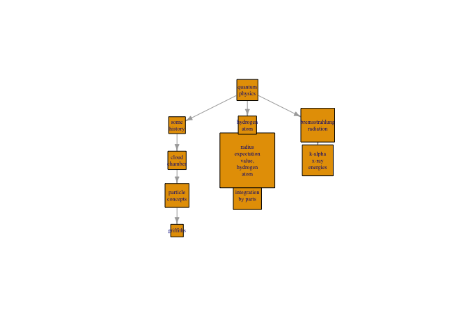
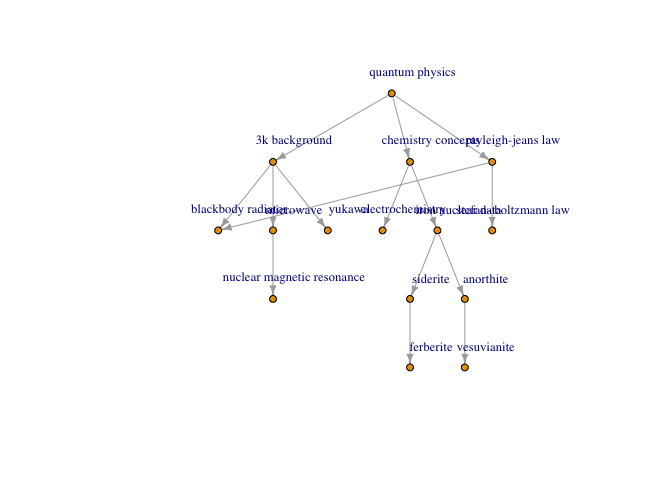
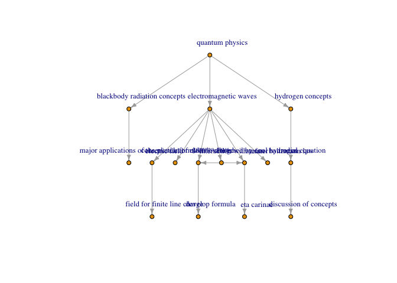

Hierarchy Extraction
================

``` r
library(igraph)
```

    ## 
    ## Attaching package: 'igraph'

    ## The following objects are masked from 'package:stats':
    ## 
    ##     decompose, spectrum

    ## The following object is masked from 'package:base':
    ## 
    ##     union

``` r
library(sna)
```

    ## Loading required package: statnet.common

    ## 
    ## Attaching package: 'statnet.common'

    ## The following object is masked from 'package:base':
    ## 
    ##     order

    ## Loading required package: network

    ## network: Classes for Relational Data
    ## Version 1.13.0 created on 2015-08-31.
    ## copyright (c) 2005, Carter T. Butts, University of California-Irvine
    ##                     Mark S. Handcock, University of California -- Los Angeles
    ##                     David R. Hunter, Penn State University
    ##                     Martina Morris, University of Washington
    ##                     Skye Bender-deMoll, University of Washington
    ##  For citation information, type citation("network").
    ##  Type help("network-package") to get started.

    ## 
    ## Attaching package: 'network'

    ## The following objects are masked from 'package:igraph':
    ## 
    ##     %c%, %s%, add.edges, add.vertices, delete.edges,
    ##     delete.vertices, get.edge.attribute, get.edges,
    ##     get.vertex.attribute, is.bipartite, is.directed,
    ##     list.edge.attributes, list.vertex.attributes,
    ##     set.edge.attribute, set.vertex.attribute

    ## sna: Tools for Social Network Analysis
    ## Version 2.4 created on 2016-07-23.
    ## copyright (c) 2005, Carter T. Butts, University of California-Irvine
    ##  For citation information, type citation("sna").
    ##  Type help(package="sna") to get started.

    ## 
    ## Attaching package: 'sna'

    ## The following objects are masked from 'package:igraph':
    ## 
    ##     betweenness, bonpow, closeness, components, degree,
    ##     dyad.census, evcent, hierarchy, is.connected, neighborhood,
    ##     triad.census

``` r
library(network)
library(statnet)
```

    ## Loading required package: tergm

    ## Loading required package: ergm

    ## 
    ## ergm: version 3.8.0, created on 2017-08-18
    ## Copyright (c) 2017, Mark S. Handcock, University of California -- Los Angeles
    ##                     David R. Hunter, Penn State University
    ##                     Carter T. Butts, University of California -- Irvine
    ##                     Steven M. Goodreau, University of Washington
    ##                     Pavel N. Krivitsky, University of Wollongong
    ##                     Martina Morris, University of Washington
    ##                     with contributions from
    ##                     Li Wang
    ##                     Kirk Li, University of Washington
    ##                     Skye Bender-deMoll, University of Washington
    ## Based on "statnet" project software (statnet.org).
    ## For license and citation information see statnet.org/attribution
    ## or type citation("ergm").

    ## NOTE: Versions before 3.6.1 had a bug in the implementation of the
    ## bd() constriant which distorted the sampled distribution somewhat.
    ## In addition, Sampson's Monks datasets had mislabeled vertices. See
    ## the NEWS and the documentation for more details.

    ## Loading required package: networkDynamic

    ## 
    ## networkDynamic: version 0.9.0, created on 2016-01-12
    ## Copyright (c) 2016, Carter T. Butts, University of California -- Irvine
    ##                     Ayn Leslie-Cook, University of Washington
    ##                     Pavel N. Krivitsky, University of Wollongong
    ##                     Skye Bender-deMoll, University of Washington
    ##                     with contributions from
    ##                     Zack Almquist, University of California -- Irvine
    ##                     David R. Hunter, Penn State University
    ##                     Li Wang
    ##                     Kirk Li, University of Washington
    ##                     Steven M. Goodreau, University of Washington
    ##                     Jeffrey Horner
    ##                     Martina Morris, University of Washington
    ## Based on "statnet" project software (statnet.org).
    ## For license and citation information see statnet.org/attribution
    ## or type citation("networkDynamic").

    ## 
    ## tergm: version 3.4.1, created on 2017-09-12
    ## Copyright (c) 2017, Pavel N. Krivitsky, University of Wollongong
    ##                     Mark S. Handcock, University of California -- Los Angeles
    ##                     with contributions from
    ##                     David R. Hunter, Penn State University
    ##                     Steven M. Goodreau, University of Washington
    ##                     Martina Morris, University of Washington
    ##                     Nicole Bohme Carnegie, New York University
    ##                     Carter T. Butts, University of California -- Irvine
    ##                     Ayn Leslie-Cook, University of Washington
    ##                     Skye Bender-deMoll
    ##                     Li Wang
    ##                     Kirk Li, University of Washington
    ## Based on "statnet" project software (statnet.org).
    ## For license and citation information see statnet.org/attribution
    ## or type citation("tergm").

    ## Loading required package: ergm.count

    ## 
    ## ergm.count: version 3.2.2, created on 2016-03-29
    ## Copyright (c) 2016, Pavel N. Krivitsky, University of Wollongong
    ##                     with contributions from
    ##                     Mark S. Handcock, University of California -- Los Angeles
    ##                     David R. Hunter, Penn State University
    ## Based on "statnet" project software (statnet.org).
    ## For license and citation information see statnet.org/attribution
    ## or type citation("ergm.count").

    ## NOTE: The form of the term 'CMP' has been changed in version 3.2
    ## of 'ergm.count'. See the news or help('CMP') for more information.

    ## 
    ## statnet: version 2016.9, created on 2016-08-29
    ## Copyright (c) 2016, Mark S. Handcock, University of California -- Los Angeles
    ##                     David R. Hunter, Penn State University
    ##                     Carter T. Butts, University of California -- Irvine
    ##                     Steven M. Goodreau, University of Washington
    ##                     Pavel N. Krivitsky, University of Wollongong
    ##                     Skye Bender-deMoll
    ##                     Martina Morris, University of Washington
    ## Based on "statnet" project software (statnet.org).
    ## For license and citation information see statnet.org/attribution
    ## or type citation("statnet").

    ## unable to reach CRAN

``` r
library(intergraph)
library(stringr)
library(stringi)
```

``` r
## Importing Data Sets
edge_list <- read.csv("Data/edge_list.csv",stringsAsFactors = FALSE)
page_details <- read.csv("Data/page_details.csv",stringsAsFactors = FALSE)
```

``` r
## Creating Network object
hyperphysics_network <- network(as.matrix(edge_list),matrix.type="edgelist",directed = TRUE)

node_names <- get.vertex.attribute(hyperphysics_network,"vertex.names") 
set.vertex.attribute(hyperphysics_network,"Titles",page_details$title[order(page_details$url)])

## IGraph object
hyperphysics_graph <- asIgraph(hyperphysics_network)
degree_dist <- data.frame(matrix(NA,nrow=dim(page_details)[1],ncol=2),stringsAsFactors = FALSE)
row.names(degree_dist) <- page_details$url
colnames(degree_dist) <- c("K_in","K_out")

for(i in seq_along(page_details$url)){
  degree_dist$K_in[i] <- length(which(edge_list$to_url == page_details$url[i]))
  degree_dist$K_out[i] <- length(which(edge_list$from_url == page_details$url[i]))
}

geodesic_distances <- geodist(hyperphysics_network,count.paths = FALSE)
avg_path_length <- average.path.length(hyperphysics_graph)
dist_path_length <- path.length.hist(hyperphysics_graph)
betweenness_centrality <- centr_betw(hyperphysics_graph)
page_rank_centrality <- page_rank(hyperphysics_graph,algo="prpack")

#####

vertex_titles <- vertex_attr(hyperphysics_graph,"Titles")
vertex_urls <- vertex_attr(hyperphysics_graph,"vertex.names")
vertex_urls <- str_to_lower(vertex_urls)
vertex_titles <- str_to_lower(vertex_titles)
in_degrees <- igraph::degree(hyperphysics_graph,mode="in")
out_degrees <- igraph::degree(hyperphysics_graph,mode="out")

hyperphysics_adjacency <- as_adj(hyperphysics_graph,type = "both")
hyperphysics_edgelist <- as_edgelist(hyperphysics_graph)
undirected_edgelist <- data.frame(rbind(hyperphysics_edgelist,cbind(hyperphysics_edgelist[,2],hyperphysics_edgelist[,1])))
undirected_edgelist <- undirected_edgelist[!duplicated(undirected_edgelist), ]
```

``` r
get_hierarchy_graph <- function(h_scores,edgelist,upper,lower){
  
  ## Score ratio for all edges
  score_ratio <- h_scores[edgelist[,1]]/ifelse(h_scores[edgelist[,2]]==0,0.00001,h_scores[edgelist[,2]])
  hierarchy_matrix <- cbind(edgelist,h_scores[edgelist[,1]], h_scores[edgelist[,2]], score_ratio)
  colnames(hierarchy_matrix) <- c("V1","V2","Score_V1","Score_V2","Score_Ratio")

  hierarchy_matrix <- hierarchy_matrix[hierarchy_matrix$Score_Ratio > lower & hierarchy_matrix$Score_Ratio <= upper,]
  
  hierarchy_matrix <- cbind(hierarchy_matrix,ifelse(hierarchy_matrix[,3] > hierarchy_matrix[,4],hierarchy_matrix[,1],hierarchy_matrix[,2]))
  hierarchy_matrix <- cbind(hierarchy_matrix,ifelse(hierarchy_matrix[,3] > hierarchy_matrix[,4],hierarchy_matrix[,2],hierarchy_matrix[,1]))
  colnames(hierarchy_matrix) <- c("V1","V2","Score_V1","Score_V2","Score_Ratio","Higher_Node","Lower_Node")

  hierarchy_edgelist <- as.matrix(hierarchy_matrix[,c(6,7)])
  hierarchy_network <- network(hierarchy_edgelist,matrix.type="edgelist",directed = TRUE)
  hierarchy_graph <- asIgraph(hierarchy_network)
  return(hierarchy_graph)
}
```

``` r
get_sub_tree <- function(st,levels=1,el,n=10){
  down_nodes <- NA
  reduced_el <- matrix(NA,ncol=2)
  for(i in c(1:levels)){
    down_nodes <- c(down_nodes,sample(el[which(el[,1] %in% st),2],min(n,length(el[which(el[,1] %in% st),2]))))
    # down_nodes <- c(down_nodes,el[which(el[,1] %in% st),2])
    down_nodes <- down_nodes[!is.na(down_nodes)]
    reduced_el <- rbind(reduced_el,el[which(el[,2] %in% down_nodes & el[,1] %in% st),])
    st <- down_nodes
  }
  reduced_el <-  reduced_el[-1,]
  reduced_el <-  reduced_el[!duplicated(reduced_el),]
  # reduced_el <- el[which(el[,2] %in% down_nodes & el[,1] %in% st),]  
  
  # down_nodes <- sample(el[which(el[,1]==st),2],min(20,length(el[which(el[,1]==st),2])))
  # reduced_el <- el[which(el[,1]==st & el[,2]==down_nodes ),]
  g <- graph_from_edgelist(reduced_el,directed = TRUE)
  return(g)
}
```

1.  Betweenness based hierarchy extraction

``` r
bw_hierarchy_score <- betweenness_centrality$res/(sqrt((1+in_degrees)*(1+out_degrees)))

upper_cutoff <- 0.8
lower_cutoff <- 0.2

bw_hierarchy_graph <- get_hierarchy_graph(bw_hierarchy_score,undirected_edgelist,upper_cutoff,lower_cutoff)
bw_hierarchy_edgelist <- as_edgelist(bw_hierarchy_graph)

## plotting sub-tree
g <- get_sub_tree(2708,5,bw_hierarchy_edgelist,n=3)
V(g)$titles <- as.character(vertex_titles[V(g)])
iso <- V(g)[igraph::degree(g)==0]
g2 <- delete_vertices(g, iso)
# V(g2)$size <- nchar(V(g2)$titles)
# V(g2)$shape <- c("rectangle") 
# plot(g2,layout=layout_as_tree,edge.arrow.size=.5, vertex.label=V(g2)$titles,vertex.size=nchar(V(g2)$titles)*5)

wrap_strings <- function(vector_of_strings,width){
  as.character(sapply(vector_of_strings, FUN=function(x){
                        paste(strwrap(x, width=width), collapse="\n")
                        }))
  }

# Apply the function to wrap the node labels
V(g2)$label = wrap_strings(V(g2)$titles, 10)

## Shrink font
V(g2)$label.cex = 0.5

# Function to increase node separation (for explanatory details, see the link below)
# Source: http://stackoverflow.com/a/28722680/496488
layout.by.attr <- function(graph, wc, cluster.strength=1,layout=layout_as_tree) {  
  g <- graph.edgelist(get.edgelist(graph)) # create a lightweight copy of graph w/o the attributes.
  E(g)$weight <- 1

  attr <- cbind(id=1:vcount(g), val=wc)
  g <- g + vertices(unique(attr[,2])) + igraph::edges(unlist(t(attr)), weight=cluster.strength)

  l <- layout(g)[1:vcount(graph),]
  return(l)
}

## Make layout reproducible. Different values will produce different layouts,
##  but setting a seed will allow you to reproduce a layout if you like it.
set.seed(3)

plot(g2,layout=layout_as_tree, vertex.shape="square", layout=layout.by.attr(g2, wc=1),vertex.size=nchar(V(g2)$titles)*2,edge.arrow.size=.5)
```



1.  Page-Rank based hierarchy extraction

``` r
pr_hierarchy_score <- page_rank_centrality$vector

upper_cutoff <- 0.8
lower_cutoff <- 0.2

pr_hierarchy_graph <- get_hierarchy_graph(pr_hierarchy_score,undirected_edgelist,upper_cutoff,lower_cutoff)
pr_hierarchy_edgelist <- as_edgelist(pr_hierarchy_graph)

## plotting sub-tree
g <- get_sub_tree(2708,5,pr_hierarchy_edgelist,n=3)
V(g)$titles <- as.character(vertex_titles[V(g)])
iso <- V(g)[igraph::degree(g)==0]
g2 <- delete_vertices(g, iso)
plot(g2,layout=layout_as_tree,edge.arrow.size=.5, vertex.size=5, vertex.label=V(g2)$titles,vertex.label.cex=0.8,vertex.label.dist=3)
```



1.  Attraction basin hierarchy

``` r
get_ab_hierarchy_score <- function(gdist,alpha,m){
  h_plus <- rep(0,dim(gdist)[1])
  h_minus <- rep(0,dim(gdist)[1])
  
  for(j in c(1:m)){  
    N_plus <- rep(0,dim(gdist)[1])
    N_minus <- rep(0,dim(gdist)[1])
    for(i in c(1:dim(gdist)[1])){
      N_plus[i] <- max(1,sum(gdist[i,] == m))
      N_minus[i] <- sum(gdist[,i] == m)
    }
    N_plus_avg <- mean(N_plus)
    N_minus_avg <- mean(N_minus)
    h_plus <- h_plus + alpha^(-j) * (N_plus / N_plus_avg)
    h_minus <- h_minus + alpha^(-j) * (N_minus / N_minus_avg)
  }
  h_score <- h_minus / h_plus
  return(h_score)
}

ab_hierarchy_score <- get_ab_hierarchy_score(geodesic_distances$gdist,alpha=2,m=3)

upper_cutoff <- 0.8
lower_cutoff <- 0.2

ab_hierarchy_graph <- get_hierarchy_graph(ab_hierarchy_score,undirected_edgelist,upper_cutoff,lower_cutoff)
ab_hierarchy_edgelist <- as_edgelist(ab_hierarchy_graph)

## plotting sub-tree
g <- get_sub_tree(2708,5,ab_hierarchy_edgelist,n=3)
V(g)$titles <- as.character(vertex_titles[V(g)])
iso <- V(g)[igraph::degree(g)==0]
g2 <- delete_vertices(g, iso)
plot(g2,layout=layout_as_tree,edge.arrow.size=.5, vertex.size=5, vertex.label=V(g2)$titles,vertex.label.cex=0.8,vertex.label.dist=3)
```


