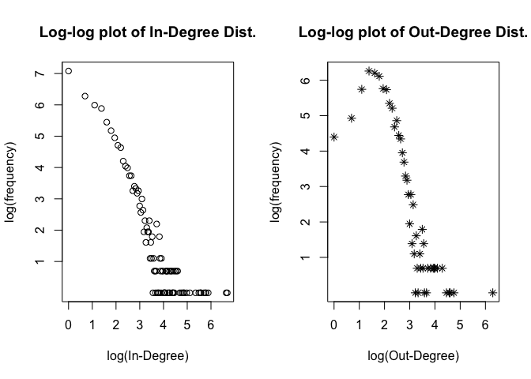
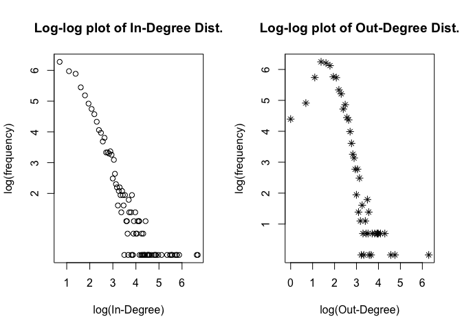

Network Analysis
================

In this file, we look at the network data obtained using the code in *web\_scraping.Rmd*

    ## 
    ## Attaching package: 'igraph'

    ## The following objects are masked from 'package:stats':
    ## 
    ##     decompose, spectrum

    ## The following object is masked from 'package:base':
    ## 
    ##     union

    ## Loading required package: statnet.common

    ## 
    ## Attaching package: 'statnet.common'

    ## The following object is masked from 'package:base':
    ## 
    ##     order

    ## Loading required package: network

    ## network: Classes for Relational Data
    ## Version 1.13.0 created on 2015-08-31.
    ## copyright (c) 2005, Carter T. Butts, University of California-Irvine
    ##                     Mark S. Handcock, University of California -- Los Angeles
    ##                     David R. Hunter, Penn State University
    ##                     Martina Morris, University of Washington
    ##                     Skye Bender-deMoll, University of Washington
    ##  For citation information, type citation("network").
    ##  Type help("network-package") to get started.

    ## 
    ## Attaching package: 'network'

    ## The following objects are masked from 'package:igraph':
    ## 
    ##     %c%, %s%, add.edges, add.vertices, delete.edges,
    ##     delete.vertices, get.edge.attribute, get.edges,
    ##     get.vertex.attribute, is.bipartite, is.directed,
    ##     list.edge.attributes, list.vertex.attributes,
    ##     set.edge.attribute, set.vertex.attribute

    ## sna: Tools for Social Network Analysis
    ## Version 2.4 created on 2016-07-23.
    ## copyright (c) 2005, Carter T. Butts, University of California-Irvine
    ##  For citation information, type citation("sna").
    ##  Type help(package="sna") to get started.

    ## 
    ## Attaching package: 'sna'

    ## The following objects are masked from 'package:igraph':
    ## 
    ##     betweenness, bonpow, closeness, components, degree,
    ##     dyad.census, evcent, hierarchy, is.connected, neighborhood,
    ##     triad.census

    ## Loading required package: tergm

    ## Loading required package: ergm

    ## 
    ## ergm: version 3.8.0, created on 2017-08-18
    ## Copyright (c) 2017, Mark S. Handcock, University of California -- Los Angeles
    ##                     David R. Hunter, Penn State University
    ##                     Carter T. Butts, University of California -- Irvine
    ##                     Steven M. Goodreau, University of Washington
    ##                     Pavel N. Krivitsky, University of Wollongong
    ##                     Martina Morris, University of Washington
    ##                     with contributions from
    ##                     Li Wang
    ##                     Kirk Li, University of Washington
    ##                     Skye Bender-deMoll, University of Washington
    ## Based on "statnet" project software (statnet.org).
    ## For license and citation information see statnet.org/attribution
    ## or type citation("ergm").

    ## NOTE: Versions before 3.6.1 had a bug in the implementation of the
    ## bd() constriant which distorted the sampled distribution somewhat.
    ## In addition, Sampson's Monks datasets had mislabeled vertices. See
    ## the NEWS and the documentation for more details.

    ## Loading required package: networkDynamic

    ## 
    ## networkDynamic: version 0.9.0, created on 2016-01-12
    ## Copyright (c) 2016, Carter T. Butts, University of California -- Irvine
    ##                     Ayn Leslie-Cook, University of Washington
    ##                     Pavel N. Krivitsky, University of Wollongong
    ##                     Skye Bender-deMoll, University of Washington
    ##                     with contributions from
    ##                     Zack Almquist, University of California -- Irvine
    ##                     David R. Hunter, Penn State University
    ##                     Li Wang
    ##                     Kirk Li, University of Washington
    ##                     Steven M. Goodreau, University of Washington
    ##                     Jeffrey Horner
    ##                     Martina Morris, University of Washington
    ## Based on "statnet" project software (statnet.org).
    ## For license and citation information see statnet.org/attribution
    ## or type citation("networkDynamic").

    ## 
    ## tergm: version 3.4.1, created on 2017-09-12
    ## Copyright (c) 2017, Pavel N. Krivitsky, University of Wollongong
    ##                     Mark S. Handcock, University of California -- Los Angeles
    ##                     with contributions from
    ##                     David R. Hunter, Penn State University
    ##                     Steven M. Goodreau, University of Washington
    ##                     Martina Morris, University of Washington
    ##                     Nicole Bohme Carnegie, New York University
    ##                     Carter T. Butts, University of California -- Irvine
    ##                     Ayn Leslie-Cook, University of Washington
    ##                     Skye Bender-deMoll
    ##                     Li Wang
    ##                     Kirk Li, University of Washington
    ## Based on "statnet" project software (statnet.org).
    ## For license and citation information see statnet.org/attribution
    ## or type citation("tergm").

    ## Loading required package: ergm.count

    ## 
    ## ergm.count: version 3.2.2, created on 2016-03-29
    ## Copyright (c) 2016, Pavel N. Krivitsky, University of Wollongong
    ##                     with contributions from
    ##                     Mark S. Handcock, University of California -- Los Angeles
    ##                     David R. Hunter, Penn State University
    ## Based on "statnet" project software (statnet.org).
    ## For license and citation information see statnet.org/attribution
    ## or type citation("ergm.count").

    ## NOTE: The form of the term 'CMP' has been changed in version 3.2
    ## of 'ergm.count'. See the news or help('CMP') for more information.

    ## 
    ## statnet: version 2016.9, created on 2016-08-29
    ## Copyright (c) 2016, Mark S. Handcock, University of California -- Los Angeles
    ##                     David R. Hunter, Penn State University
    ##                     Carter T. Butts, University of California -- Irvine
    ##                     Steven M. Goodreau, University of Washington
    ##                     Pavel N. Krivitsky, University of Wollongong
    ##                     Skye Bender-deMoll
    ##                     Martina Morris, University of Washington
    ## Based on "statnet" project software (statnet.org).
    ## For license and citation information see statnet.org/attribution
    ## or type citation("statnet").

    ## unable to reach CRAN

First, we looking at some high-level Networks Stats

``` r
paste("No. of Nodes: ",dim(page_details)[1])
```

    ## [1] "No. of Nodes:  3909"

``` r
paste("No. of Edges: ",dim(edge_list)[1])
```

    ## [1] "No. of Edges:  27989"

``` r
network_density <- dim(edge_list)[1]/(dim(page_details)[1]*(dim(page_details)[1]-1))
paste("Density: ",round(network_density,5))
```

    ## [1] "Density:  0.00183"

``` r
print("Sample of Nodes:")
```

    ## [1] "Sample of Nodes:"

``` r
head(page_details,5)
```

    ##          url        title
    ## 1  acca.html acceleration
    ## 2  vel2.html     velocity
    ## 3  vect.html       vector
    ## 4 units.html        units
    ## 5 deriv.html   derivative

``` r
print("Sample of Edges:")
```

    ## [1] "Sample of Edges:"

``` r
head(edge_list,5)
```

    ##    from_url     to_url
    ## 1 acca.html  vel2.html
    ## 2 acca.html  vect.html
    ## 3 acca.html units.html
    ## 4 acca.html deriv.html
    ## 5 acca.html   mot.html

``` r
## Degree Distribution

degree_dist <- data.frame(matrix(NA,nrow=dim(page_details)[1],ncol=2),stringsAsFactors = FALSE)
row.names(degree_dist) <- page_details$url
colnames(degree_dist) <- c("K_in","K_out")


for(i in seq_along(page_details$url)){
  degree_dist$K_in[i] <- length(which(edge_list$to_url == page_details$url[i]))
  degree_dist$K_out[i] <- length(which(edge_list$from_url == page_details$url[i]))
}

head(degree_dist[order(degree_dist$K_in,decreasing = TRUE ),])
```

    ##                      K_in K_out
    ## geophys/geophys.html  802     2
    ## geophys/mineral.html  764   540
    ## emcon.html            359     1
    ## quacon.html           325     2
    ## heacon.html           322     1
    ## astro/astcon.html     300     1

``` r
head(degree_dist[order(degree_dist$K_out,decreasing = TRUE ),])
```

    ##                      K_in K_out
    ## geophys/mineral.html  764   540
    ## thermo/                 1   116
    ## qcc/qcc6.html           0   100
    ## quantum/ ../exp.html    2    96
    ## Sound                   0    86
    ## Tables/ttab.html       37    73

``` r
## Avg. Degrees
paste("Mean In-Degree: ",round(mean(degree_dist$K_in),4))
```

    ## [1] "Mean In-Degree:  7.1601"

``` r
paste("Mean Out-Degree: ",round(mean(degree_dist$K_out),4))
```

    ## [1] "Mean Out-Degree:  7.1601"

``` r
## Plots of Degree Distribution
par(mfrow=c(1,2))
plot(log(as.numeric(row.names(table(degree_dist$K_in)))[-1]),log(table(degree_dist$K_in)[-1]),main="Log-log plot of In-Degree Dist.",xlab="log(In-Degree)",ylab="log(frequency)",type="p",pch=1)

plot(log(as.numeric(row.names(table(degree_dist$K_out)))[-1]),log(table(degree_dist$K_out)[-1]),main="Log-log plot of Out-Degree Dist.",xlab="log(Out-Degree)",ylab="log(frequency)",type="p",pch=8)
```



``` r
## Creating Network object
hyperphysics_network <- network(as.matrix(edge_list),matrix.type="edgelist",directed = TRUE)

node_names <- get.vertex.attribute(hyperphysics_network,"vertex.names") 
set.vertex.attribute(hyperphysics_network,"Titles",page_details$title[which(page_details$url %in% get.vertex.attribute(hyperphysics_network,"vertex.names"))])

## IGraph object
hyperphysics_graph <- asIgraph(hyperphysics_network)


geodesic_distances <- geodist(hyperphysics_network,count.paths = FALSE)
geodesic_distances_vector <- as.vector(geodesic_distances$gdist)
geodesic_distances_table <- table(geodesic_distances_vector)
geodesic_distances_table <- geodesic_distances_table/sum(geodesic_distances_table)
plot(as.numeric(row.names(geodesic_distances_table)[2:(length(geodesic_distances_table)-1)]),geodesic_distances_table[2:(length(geodesic_distances_table)-1)],main="Distribution of Geodesic Distances",xlab = "Geodesic Path length",ylab="Frequency",type='o',pch=1)
```



``` r
betweenness_centrality <- betweenness(hyperphysics_network)
```
